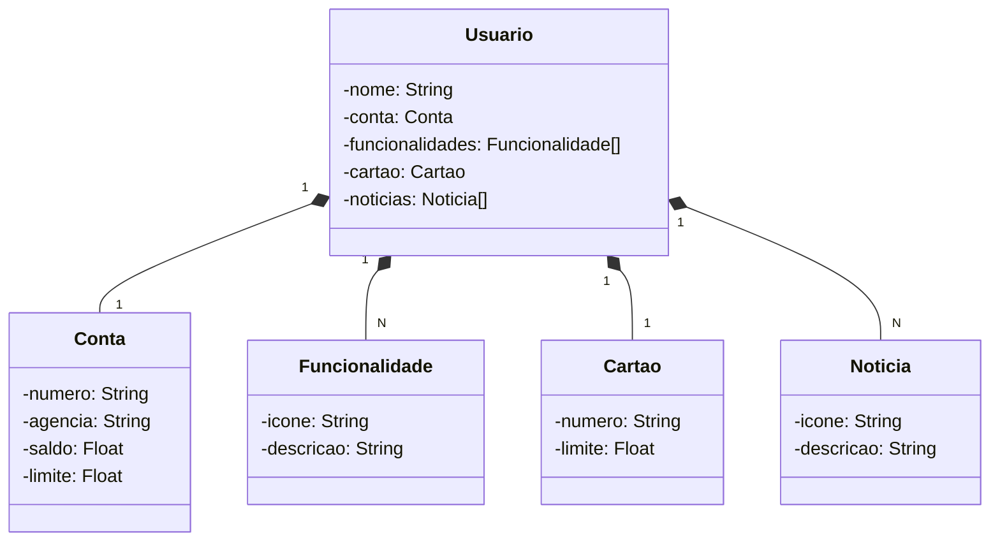

# Desafio de Projetos da Dio - Publicando Sua API REST na Nuvem Usando Spring Boot 3, Java 17 e Railway
Reposítório para o Desafio de Projetos da Dio - Publicando Sua API REST na Nuvem Usando Spring Boot 3, Java 17 e Railway

## Projeto de Referência:
https://github.com/falvojr/santander-dev-week-2023

## Diagrama de Classes:

